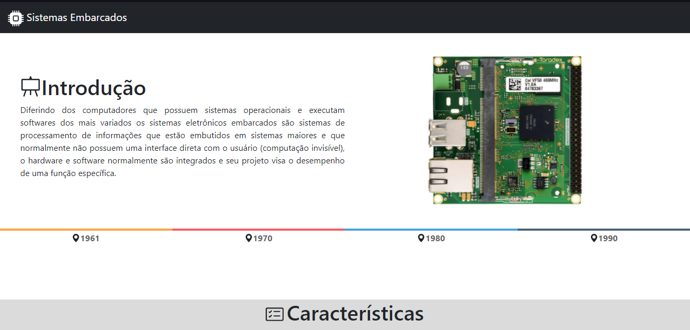
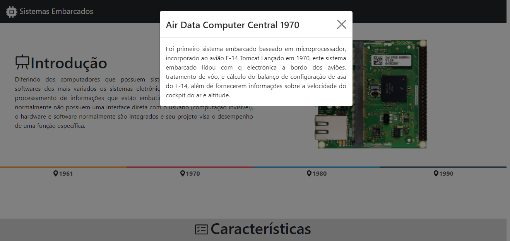
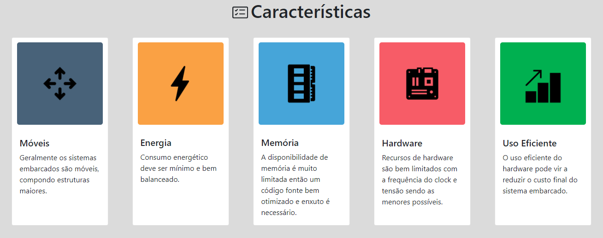

<h1 align="center">Sistema Embarcado</h1><!--Nome curto e objetivo-->
<h5 align="center">Status: Em andamento </h5><!--Concluido, Em andamento ou Finalizado-->

<h2>Sumário</h2>
<!--Sumário que leva as sessões do readme-->
<ul>
    <li><a href="#sobre">Sobre</a></li>
    <li><a href="#requisitosmacro">Requisitos macro</a></li>
    <li><a href="#demo">Demonstração da aplicação</a></li>
    <li><a href="#prereq">Pré-requisitos e como rodar a aplicação</a></li>
    <li><a href="#comorodar">Como rodar o projeto</a></li>
    <li><a href="#tec">Tecnologias utilizadas</a></li>
    <li><a href="#doc">Documentação</a></li>
    <li><a href="#autor">Responsáveis</a></li>
</ul>

<h2 id="sobre">💻 Sobre</h2>
<!--Descrição do contexto e produto do projeto - Consulte o documento F001-NDSI-Levantamento de Macro Requisitos-->

A página WEB desenvolvida tem como tema os sistemas embarcados, este projeto foi uma revisão de design do projeto da disciplina de Arquitetura e Organização de Computadores II do semestre 2022.1 regida pelo professor Sanval Ebert.

O site desenvolvido concatena os principais tópicos ligados aos sistemas embarcados dividido em: introdução, características, linha do tempo, microcontroladores, componentes dos microcontroladores, aplicações e o mercado dos sistemas embarcados.

<h2 id="requisitosmacro">📝 Requisitos macro</h2>
<!--Lista de todos as funcionalidades do sistema (nível macro)-->
<ul>
    <li>Design responsivo</li>
</ul>

<h2 id="demo">🎥 Demonstração da aplicação</h2>
<!--Conjunto de prints da aplicação-->
<h1 align="center">
    
    
    
    
    
</h1>

<h2 id="prereq">📀 Pré-requisitos de instalação</h2>
<!--Descrição do pré requisito de instalação na maquina em forma de passo a passo-->

<ul>
    <li>Node js LTS</li>
    <li>Pacote npm 8.3.1</li>
    <li>Angular CLI 13</li>
    <li>editor de código fonte</li>
</ul>

<h2 id="comorodar">:memo: Como rodar o projeto</h2>
<!--Descrição do pré requisito de instalação na maquina em forma de passo a passo-->

<ol>
    <li>Clone o repositório na sua máquina</li>
    <li>Acesse a pasta do projeto pelo CMD</li>
    <li>Dentro da pasta no CMD, insirá o comando <code>npm install</code></li>
    <li>Inicie o projeto no servidor de denvolvimento com <code>ng serve</code></li>
    <li>Acesse um navegador e busque a url <code>http://localhost:4200/</code></li>
</ol>

<h2 id="tec">🔨Tecnologias utilizadas</h2>
<!--Descrição das tecnologias utilizadas (linguagem, biblioteca, framework etc)-->

As seguintes ferramentas foram utilizadas na construção do projeto:

<ul>
    <li>Node JS</li>
    <li>NPM</li>
    <li>Angular</li>
    <li>HTML 5</li>
    <li>CSS 3</li>
    <li>TYPESCRIPT</li>
</ul>

<h2 id="doc">📖 Documentos</h2>
<ul>
  <li><a href="https://docs.google.com/document/d/1EZDCoZu0S9y6QLZ2JBDsU9UBixwEyxdTG0qXQgDAIP0/edit?usp=sharing">Pesquisa sobre sistemas embarcados</a></li>
</ul>

<h2 id="autor">👦 Responsáveis</h2>
<!--Listagem dos responsáveis pelo projeto-->
<ul>
   <li>Patrick Guilherme da Silva</li>
<ul>
